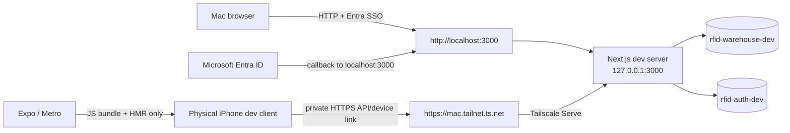

# Plan 011: Make local development one-command, stable, and phone-reachable

> **Executor instructions**: Follow this plan step by step. Run every
> verification command and confirm the expected result before moving to the
> next step. If anything in the "STOP conditions" section occurs, stop and
> report — do not improvise. When done, update this plan's status row in
> `plans/README.md`, unless a reviewer explicitly says they maintain the index.
>
> **Drift check (run first)**:
>
> ```bash
> git diff --stat c0afa27..HEAD -- \
>   package.json pnpm-lock.yaml pnpm-workspace.yaml .gitignore \
>   scripts apps/web apps/field packages .github README.md docs plans/README.md
> ```
>
> A separate dev-infrastructure task was still awaiting operator authentication
> when this plan was written. In particular, it may change
> `scripts/setup-dev-turso.sh`, `scripts/pull-dev-env.sh`,
> `scripts/merge-vercel-env.mjs`, `apps/web/.env.example`,
> `apps/web/src/lib/env.ts`, `apps/web/src/lib/auth.ts`,
> `apps/web/src/lib/session.ts`, `apps/web/src/proxy.ts`, and both device-link
> implementations. If any in-scope file changed after `c0afa27`, compare the
> excerpts below to live code. If behavior or interfaces differ, STOP and report
> the drift instead of applying this plan mechanically.

## Status

- **Priority**: P1
- **Effort**: L (approximately 3–5 engineering days, plus tailnet admin time)
- **Risk**: MED
- **Depends on**: completion and verification of the isolated
  `rfid-warehouse-dev` + `rfid-auth-dev` Turso/Vercel Development setup
  described in `apps/web/README.md`; does **not** depend on Plan 010
- **Category**: dx
- **Planned at**: commit `c0afa27`, 2026-07-23

## Why this matters

The physical iPhone receives JavaScript from Metro, but it must independently
reach the local Next.js API for device linking, health checks, and future sync.
Browser auth already has the correct canonical origin:
`http://localhost:3000`. The missing seam is a stable, private device API origin
that reaches the same process without changing Better Auth's browser/SSO
identity.

After this plan, a fresh developer has one setup command, one daily command,
fixed localhost web auth, a separate private Tailscale HTTPS device API origin,
real SSO by default, automatic device-origin handoff in the link QR, actionable
diagnostics, deterministic tests, and a documented native-rebuild path.
Production data movement remains in Plan 010.

## Target architecture



There are deliberately **two origins**:

1. **Web/SSO origin**: `http://localhost:3000`. The Mac browser signs in here;
   `BETTER_AUTH_URL` stays exactly this value; Entra's development redirect is
   `http://localhost:3000/api/auth/callback/microsoft`.
2. **Field API origin**: discovered from Tailscale as
   `https://<machine>.<tailnet>.ts.net`. The iPhone uses this only for
   one-time-token exchange and future API/sync traffic. It is typed separately
   as `FIELD_DEVICE_API_ORIGIN`; it is never Better Auth's `baseURL`.

Tailscale Serve is the recommended transport because the developer Mac and
physical iPhone can join the same tailnet. The verified Tailscale 1.96.4 syntax
is:

```bash
tailscale serve --bg http://127.0.0.1:3000
```

Serve is private to the tailnet. Do not enable Tailscale Funnel. Setup discovers
the canonical `*.ts.net` name from `tailscale status --json` (`Self.DNSName`,
with a trailing dot removed) and verifies the proxy with
`tailscale serve status --json`; it does not hardcode a machine/tailnet name.

Expo/Metro remains a separate JS bundle/HMR transport. An ngrok reserved domain
is a fallback only for contributors who cannot join the tailnet, and it remains
the **Field API origin only**; localhost remains Web/SSO. Cloudflare Tunnel and
DNS delegation remain rejected/out of scope.

## Current state

### Repository and commands

- The root is a pnpm workspace with `apps/field`, `apps/web`,
  `packages/domain`, and `packages/reader-protocol`
  (`pnpm-workspace.yaml:1-5`).
- The root has only aggregate verification scripts; there is no root dev
  orchestrator (`package.json:7-10`):

  ```json
  "scripts": {
    "typecheck": "pnpm -r typecheck",
    "test": "pnpm -r test"
  }
  ```

- `apps/web` starts Next with no fixed port
  (`apps/web/package.json:5-14`):

  ```json
  "dev": "next dev",
  "build": "next build",
  "lint": "eslint",
  "typecheck": "tsc --noEmit",
  "test": "echo \"no tests yet\" && exit 0",
  "pull:dev": "bash ../../scripts/pull-dev-env.sh"
  ```

- `apps/field` currently makes a native device build its daily `dev` command,
  while tests are a placeholder (`apps/field/package.json:69-76`):

  ```json
  "start": "expo start",
  "dev": "expo run:ios --device",
  "typecheck": "tsc --noEmit",
  "test": "echo \"no tests yet\" && exit 0"
  ```

  `expo run:ios --device` is required after native dependency/config changes or
  on a device without the dev client. Normal daily work should use
  `expo start --dev-client` against the already installed native dev client.
- The repo's explicit local auth configuration already standardizes port 3000:
  `apps/web/.env.example:15-16`, `scripts/setup-dev-turso.sh:23-25`, and
  `apps/web/README.md:10-14,81-84` all use
  `BETTER_AUTH_URL=http://localhost:3000`. Plan 011 must make the Next command
  fail if 3000 is occupied, not move auth to another port or origin.

### Local env and isolated databases

- `apps/web/src/lib/env.ts` is the only sanctioned `process.env` read in web
  request code. It validates once with zod and requires `BETTER_AUTH_URL` when
  `BETTER_AUTH_SECRET` is present (`apps/web/src/lib/env.ts:39-85`):

  ```ts
  BETTER_AUTH_SECRET: z.string().min(1).optional(),
  BETTER_AUTH_URL: z.string().url().optional(),
  // ...
  if (val.BETTER_AUTH_SECRET && !val.BETTER_AUTH_URL) {
    // clear validation issue
  }
  ```

- The safe env pull already uses a temp file and an allowlist. It preserves
  local-only values and never prints values
  (`scripts/pull-dev-env.sh:12-20`,
  `scripts/merge-vercel-env.mjs:19-26,64-90`).
- `scripts/setup-dev-turso.sh:23-25` already hard-codes the correct local
  Web/SSO origin:

  ```bash
  WH_DB="rfid-warehouse-dev"
  AUTH_DB="rfid-auth-dev"
  BA_URL="http://localhost:3000"
  ```

- At planning time, the Vercel project link and Microsoft Development env names
  existed, but the six Vercel-managed dev names
  (`TURSO_DATABASE_URL`, `TURSO_AUTH_TOKEN`, `AUTH_DATABASE_URL`,
  `AUTH_DATABASE_AUTH_TOKEN`, `BETTER_AUTH_SECRET`, `BETTER_AUTH_URL`) were not
  listed. Turso schema queries reported that CLI login was required. Therefore
  the isolated dev setup was **not verified complete** even though its scripts
  were committed. This is a prerequisite, not work to silently fold into Plan
  010 or production resources.
- Plan 010 owns production/preview Turso sync, import, and cutover. This plan
  may validate the isolated development databases and their migrations, but it
  must not import production data, create production tokens, or alter
  production/preview Vercel env.

### Auth and device linking

- Better Auth 1.6.18 uses a separate auth database, Entra as the only real
  sign-in provider, the `oneTimeToken` plugin, and bearer sessions
  (`apps/web/src/lib/auth.ts:80-142`). `BETTER_AUTH_URL` is the canonical
  callback/cookie origin.
- The primary session seam checks the fake bypass before the real session
  (`apps/web/src/lib/session.ts:39-52`):

  ```ts
  if (isDevBypassActive()) {
    return devBypassUser();
  }
  ```

  The bypass is production-guarded, but the fake identity is currently only
  visible as the ordinary `"Dev User"` (`apps/web/src/lib/dev-bypass.ts:24-42`);
  it can be mistaken for a real SSO session.
- `/api/health` is unauthenticated and checks the warehouse database
  (`apps/web/src/app/api/health/route.ts:5-17`). It currently returns the raw
  caught error message on failure. A tailnet-visible endpoint must return an
  actionable status without exposing connection details or tokens.
- The web QR currently contains only the token
  (`apps/web/src/app/link-device/LinkDeviceClient.tsx:58-66`):

  ```tsx
  <QRCodeSVG value={token} size={224} level="M" />
  ```

- The phone scanner trims that raw token, loads the manually configured URL,
  and exchanges against it (`apps/field/app/link-device.tsx:35-45`):

  ```ts
  const token = data.trim();
  const serverUrl = await getServerUrl();
  await exchangeOneTimeToken(serverUrl, token);
  ```

- Phone URL validation is already pure and security-aware. It normalizes
  trailing slashes and rejects public HTTP while allowing loopback/private
  development hosts (`apps/field/src/auth/credential.ts:69-128`). Preserve this
  policy, manual Settings override, and `testServerConnection()`.
- `apps/field/src/components/ui/alert-dialog.tsx:140-152` exports the full
  React Native Reusables confirmation surface (`AlertDialog`,
  `AlertDialogContent`, `AlertDialogTitle`, `AlertDialogDescription`,
  `AlertDialogAction`, `AlertDialogCancel`, and layout pieces). Use it for
  origin-switch confirmation; do not introduce an ad-hoc modal.

### Tooling and tests

- At planning time: Node `25.9.0`, pnpm `10.33.2`, Vercel CLI `52.0.0`, Turso
  CLI `1.0.30`, Tailscale `1.96.4`, ngrok `3.39.6`, and Xcode `26.6` were
  installed. Port 3000 was occupied and `tailscale status --json` did not
  confirm a signed-in node. These are observations only; setup/doctor must
  identify the listener and verify the live developer environment.
- There is no `.github/workflows/` CI and no app-level web/field test suite.
  Existing Vitest style is simple colocated `describe`/`test`/`expect`, for
  example `packages/reader-protocol/src/session.test.ts:1-24`.
- UI conventions remain those in `plans/README.md`: shadcn/ui for web and React
  Native Reusables + NativeWind for field. Apps import shared packages; they do
  not import each other.

## Commands you will need

These are the exact existing gates plus the commands this plan adds:

| Purpose | Command | Expected on success |
|---|---|---|
| Install | `pnpm install --frozen-lockfile` | exit 0; lockfile unchanged |
| Existing typecheck | `pnpm -r typecheck` | exit 0, no TS errors |
| Existing tests | `pnpm test` (`pnpm -r test` underneath today) | exit 0 (web/field are placeholders before this plan) |
| Web lint | `pnpm --filter @rfid/web lint` | exit 0 |
| Web build | `pnpm --filter @rfid/web build` | exit 0 |
| Field bundle | `pnpm --filter @rfid/field exec expo export --platform ios` | exit 0 |
| One-time bootstrap (new) | `pnpm dev:setup` | exits 0 after printing only names/statuses |
| Doctor (new) | `pnpm dev:doctor` | all required checks PASS; no secret values |
| Daily stack (new) | `pnpm dev` | localhost web, Tailscale Serve Field API, and Metro all READY |
| UI-only bypass (new) | `pnpm dev:bypass` | starts same stack with a conspicuous BYPASS label |
| Native dev-client rebuild (new) | `pnpm dev:native` | app builds/installs on selected iPhone |
| Offline supervisor smoke (new) | `pnpm dev:smoke` | mock web/Tailscale/Metro lifecycle passes |

Do not run `vercel env pull apps/web/.env.local` directly. The existing safe
`pull:dev` path must remain the only env-pull route.

## Suggested executor toolkit

- Follow the repo's `vercel-react-best-practices` skill when changing Next/React
  components and async process startup.
- Follow `vercel-composition-patterns` when adding the field confirmation UI;
  use the existing compound `AlertDialog` components.
- Read Tailscale Serve (`https://tailscale.com/kb/1242/tailscale-serve`), HTTPS
  (`https://tailscale.com/kb/1153/enabling-https`), and tailnet-policy docs
  (`https://tailscale.com/kb/1337/acl-syntax`) plus Better Auth Security
  (`https://better-auth.com/docs/reference/security`) and Options
  (`https://better-auth.com/docs/reference/options`). The exact Serve/Funnel
  commands were also verified against local Tailscale 1.96.4 help.

## Scope

**In scope** (the only source/config/docs files this plan may modify):

- Root tooling: `package.json`, `pnpm-lock.yaml`, `pnpm-workspace.yaml`,
  `.gitignore`
- New typed tooling: `scripts/dev/**`
- Existing dev-infra scripts: `scripts/setup-dev-turso.sh`,
  `scripts/pull-dev-env.sh`, `scripts/merge-vercel-env.mjs`
- New shared package: `packages/device-link-protocol/**`
- Web config/tooling:
  - `apps/web/package.json`
  - `apps/web/.env.example`
  - `apps/web/next.config.ts`
  - `apps/web/auth.ts` only if CLI env loading must be aligned
  - `apps/web/src/lib/env.ts`
  - `apps/web/src/lib/auth.ts`
  - `apps/web/src/lib/dev-bypass.ts`
  - `apps/web/src/lib/session.ts`
  - `apps/web/src/app/api/health/route.ts`
- Web link/bypass UI:
  - `apps/web/src/app/link-device/actions.ts`
  - `apps/web/src/app/link-device/page.tsx`
  - `apps/web/src/app/link-device/LinkDeviceClient.tsx`
  - `apps/web/src/components/Header.tsx`
  - `apps/web/src/components/UserMenu.tsx`
- Field link/config UI:
  - `apps/field/package.json`
  - `apps/field/src/auth/credential.ts`
  - `apps/field/src/auth/index.ts`
  - `apps/field/app/link-device.tsx`
  - `apps/field/app/settings.tsx`
- CI/docs: `.github/workflows/ci.yml`, `README.md`,
  `apps/web/README.md`, `docs/local-development.md`
- Plan status only: `plans/README.md`

Tests colocated under the directories above are in scope.

**Out of scope** (do NOT touch, even if related):

- `apps/web/.env.local`, any committed env file containing values, Tailscale
  node state/auth keys, tailnet policy files, or ngrok's user config.
  Credentials and tokens stay outside git.
- Production/Preview Vercel env, production/preview Turso databases, production
  import/cutover, sync cadence, BOL upload, EAS, Sentry, or OTA updates. Those
  remain Plan 010 work.
- Vercel Deployment Protection bypass secrets. Do not add one to env, QR,
  Expo config, or the mobile bundle; the phone reaches the local process over
  private Serve, not a protected Vercel deployment.
- Replacing Metro transport with Serve, cloud-only development, Expo Go support,
  Android-specific setup, or a new native dependency.
- Tailscale Funnel/public exposure. Serve must remain tailnet-only.
- Editing organization tailnet policy from this repo. The plan documents the
  required least-privilege grant/tag; a tailnet admin applies it separately.
- Cloudflare Tunnel or Cloudflare DNS migration/delegation. Reconsider only
  through a future explicit infrastructure decision.
- Changing one-time-token lifetime/session semantics or implementing custom
  token crypto.
- Unrelated UI, domain repositories/schema, warehouse behavior, reader,
  printer, BOL, or legacy Python apps.

## Git workflow

- Branch: `advisor/011-local-development-dx`
- Commit by logical unit; use the observed scoped conventional style, e.g.
  `fix(field): robust QR device-link server URL UX`.
- Never commit `apps/web/.env.local`, Tailscale auth/node state, tailnet policy,
  ngrok auth, Turso tokens, or generated Serve config.
- Do not push or open a PR unless the operator explicitly instructs it.

## Steps

### Step 0: Satisfy infrastructure and hostname decision gates

This step is partly operator-owned and must finish before source changes.

1. Run the drift command at the top of this plan. Confirm the recent isolated
   dev-infrastructure and `/login`/`/link-device` fixes still match the current
   state above.
2. Verify the Vercel project is linked and Development env contains these names
   (values remain masked):
   `TURSO_DATABASE_URL`, `TURSO_AUTH_TOKEN`, `AUTH_DATABASE_URL`,
   `AUTH_DATABASE_AUTH_TOKEN`, `BETTER_AUTH_SECRET`, `BETTER_AUTH_URL`, and the
   three `MICROSOFT_*` names.
3. Authenticate Turso interactively if required. Verify
   `rfid-warehouse-dev` contains the checked-in Drizzle migrations/domain
   tables and `rfid-auth-dev` contains Better Auth's
   `user/session/account/verification` tables. Do not inspect user rows.
4. Free port 3000 if another process owns it. Keep
   `BETTER_AUTH_URL=http://localhost:3000` in Vercel Development and
   `.env.local`; do not replace it with a Tailscale/ngrok URL.
5. Have a tailnet administrator verify MagicDNS and HTTPS certificates are
   enabled. Review the Certificate Transparency warning: the Mac's machine name
   will become public in certificate logs, so rename it first if the hostname
   contains sensitive information.
6. Join the developer Mac and physical iPhone to the same tailnet. On both
   devices, confirm Tailscale is connected. Restrict access with the
   organization's tailnet policy:
   - for individually owned dev Macs, grant only the approved developer
     user/group and approved iPhone identities access to that Mac's HTTPS/443;
   - for a standardized dev Mac/service endpoint, tag it (recommended shape
     `tag:rfid-dev`) and grant only the developer group/devices to
     `tag:rfid-dev:443`.
   Do not grant all tailnet users, commit policy here, or tag a personal node
   without admin review.
7. Run the verified current command:
   `tailscale serve --bg http://127.0.0.1:3000`. Discover the canonical Field
   API origin from `tailscale status --json` → `Self.DNSName` (strip the final
   dot), then verify `tailscale serve status --json` maps HTTPS to
   `http://127.0.0.1:3000`.
8. Verify `tailscale funnel status --json` has no Funnel listener/config.
   Never run `tailscale funnel`.
9. Keep the Entra development redirect at
   `http://localhost:3000/api/auth/callback/microsoft`. Do not register a
   per-developer `*.ts.net` redirect. The Mac browser signs in on localhost.
10. Only if a contributor cannot join the tailnet, provision an approved
    reserved/static ngrok endpoint as the Field API fallback. It proxies
    `127.0.0.1:3000` but is never `BETTER_AUTH_URL` and never an Entra redirect.

If the Mac/iPhone cannot join the same authorized tailnet and no approved
reserved ngrok fallback exists, STOP. Do not use Funnel, an ephemeral endpoint,
or the tailnet URL as Better Auth's canonical origin.

**Verify**:

```bash
vercel env ls development
turso db shell rfid-warehouse-dev \
  "SELECT name FROM sqlite_master WHERE type='table' ORDER BY name;"
turso db shell rfid-auth-dev \
  "SELECT name FROM sqlite_master WHERE type='table' ORDER BY name;"
tailscale status --json
tailscale serve --bg http://127.0.0.1:3000
tailscale serve status --json
tailscale funnel status --json
```

Expected: Vercel prints the nine required names with masked values; warehouse
tables and Better Auth tables are listed by name; no production database is
queried. `BETTER_AUTH_URL` remains localhost (verify value without printing
other values); Tailscale reports the signed-in Mac, Serve maps private HTTPS to
`127.0.0.1:3000`, and Funnel reports no active configuration. From the iPhone,
opening `<discovered-field-origin>/api/health` while Tailscale is active reaches
the Mac. This phone check is required because a Mac-only doctor cannot inspect
iOS VPN/DNS state directly.

### Step 1: Add one validated local-DX configuration and shared QR protocol

1. Add `"packageManager": "pnpm@10.33.2"` to root `package.json` so Corepack,
   CI, and the doctor agree. Keep the existing Node `>=20` engine and have the
   doctor validate against it rather than requiring the planning machine's
   Node 25.
2. Add direct root development dependencies needed by the tooling. Prefer:
   - `tsx` for typed scripts,
   - `vitest` for config/supervisor tests,
   - `execa` for child-process lifecycle and signal handling.
   Do not rely on transitive copies already visible in `pnpm-lock.yaml`.
   Use `pnpm add -Dw tsx@^4.0.0 vitest@^2.0.0 execa@^9.6.1`, then update the
   lockfile after adding the new workspace/package dependencies. Verification
   uses `--frozen-lockfile` only after those intentional lockfile updates.
3. Add server-only `FIELD_DEVICE_API_ORIGIN` to
   `apps/web/src/lib/env.ts` and `.env.example`. This is the separately named,
   typed origin embedded in the device-link QR and used for field API/sync
   traffic. Its **Development Tailscale value** is local-only/per-developer: do
   not add that value to
   `scripts/merge-vercel-env.mjs#VERCEL_MANAGED`, Vercel Development, or any
   `NEXT_PUBLIC_*` schema. Add `FIELD_DEVICE_API_TRANSPORT` as an optional typed
   enum (`"tailscale"` default, `"ngrok"` fallback) only if the orchestrator
   needs to select its lifecycle.
   The variable itself is environment-neutral: Production/Preview may set an
   approved public Field API origin through their existing deployment-ops
   process so the same v1 payload works there. Plan 011 must not mutate those
   environments; local setup writes only the per-developer Tailscale value.
4. `scripts/dev/config.ts` must load the validated web env and expose the
   distinction explicitly:

   ```ts
   interface DevRuntimeConfig {
     webPort: 3000;
     webSsoOrigin: "http://localhost:3000";
     fieldDeviceApiOrigin: string;
     fieldDeviceApiTransport: "tailscale" | "ngrok";
   }
   ```

   Require `BETTER_AUTH_URL === webSsoOrigin`; fail if it equals
   `fieldDeviceApiOrigin`. Require the device origin to be an exact HTTPS origin
   with no credentials/path/query/hash. The default transport requires a
   discovered `.ts.net` hostname; fallback requires an approved reserved ngrok
   hostname. Reject Funnel/public-Tailscale configuration, Cloudflare, random
   endpoints, and any attempt to make the device origin canonical web auth.
5. Create `packages/device-link-protocol` as a pure TypeScript ESM workspace
   package following `packages/reader-protocol` structure and Vitest style. Add
   it to `pnpm-workspace.yaml`, `apps/web`, and `apps/field`; add it to
   `next.config.ts#transpilePackages`.
6. Export a strict v1 payload API:

   ```ts
   interface DeviceLinkPayloadV1 {
     v: 1;
     token: string;
     deviceApiOrigin: string;
   }

   encodeDeviceLinkPayload(input): string
   parseDeviceLinkPayload(raw): ParseResult
   validateDeviceApiOrigin(raw): OriginValidation
   ```

   The encoded form is compact JSON with exactly `v`, `token`, and
   `deviceApiOrigin`. Cap QR input/token lengths, reject unknown versions/fields
   and malformed JSON, normalize through `URL`, and require HTTPS for a QR
   device origin. A device origin has no username/password, non-root path,
   query, or hash. Keep a clearly marked legacy bare-token result: it uses the
   phone's already trusted manual origin and can never switch origin.
7. Move/re-export the current pure URL helpers from
   `apps/field/src/auth/credential.ts` through the shared package so Settings
   retains its current API and LAN HTTP fallback without two validators
   drifting. The QR validator is stricter (HTTPS only); manual Settings may
   preserve the existing private-LAN HTTP fallback.

**Verify**:

```bash
pnpm install --frozen-lockfile
pnpm --filter @rfid/device-link-protocol typecheck
pnpm --filter @rfid/device-link-protocol test
pnpm --filter @rfid/field typecheck
pnpm --filter @rfid/web typecheck
```

Expected: all exit 0; protocol tests cover v1, legacy, distinct web/device
origins, strict QR HTTPS, manual private-HTTP fallback, malformed/oversized
payloads, a generic approved production HTTPS origin, and rejection if the
device origin replaces `BETTER_AUTH_URL`.

### Step 2: Build the safe setup and doctor commands

Create typed entry points under `scripts/dev/` and wire root scripts:

```json
"dev:setup": "tsx scripts/dev/setup.ts",
"dev:doctor": "tsx scripts/dev/doctor.ts"
```

`dev:setup` must:

1. Check Node/pnpm and required CLIs (`vercel`, `turso`, `tailscale`, Xcode
   command-line tools) before any external write. Check `ngrok` only when the
   operator explicitly selects fallback transport.
2. Parse `tailscale status --json`; require signed-in/running state and a
   non-empty `Self.DNSName`. Normalize it to
   `https://<Self.DNSName-without-trailing-dot>`. Never accept a hardcoded
   machine/tailnet hostname, echo the raw status JSON, or print peer inventory.
3. Check Vercel login/project link and Turso login. If the isolated dev setup is
   incomplete, invoke the existing idempotent `scripts/setup-dev-turso.sh` only
   after prerequisites pass. Preserve its existing
   `BETTER_AUTH_URL=http://localhost:3000`; it must remain restricted to the two
   `*-dev` database names and Vercel Development.
4. Run the existing safe temp-file pull/allowlist merge. Do not replace
   `.env.local`, Microsoft values, bypass preferences, comments, or `LOCAL_*`.
5. Update only the local-only `FIELD_DEVICE_API_ORIGIN` line in
   `apps/web/.env.local` with the discovered Tailscale HTTPS origin (or approved
   fallback), preserving all other lines. Load the file without echoing values
   and run the same zod schema used by `apps/web/src/lib/env.ts`.
6. Assert and print the two origins with unambiguous labels:
   - `Web/SSO: http://localhost:3000`
   - `Field API: https://<machine>.<tailnet>.ts.net`
   Fail if `BETTER_AUTH_URL` differs from localhost or equals
   `FIELD_DEVICE_API_ORIGIN`.
7. Query only table/migration names in both dev databases. Fail with the exact
   migration command when missing; never auto-target a database whose name
   lacks the `-dev` suffix.
8. Verify MagicDNS/HTTPS prerequisites and the Serve/Funnel status. If Serve is
   absent, configure it with
   `tailscale serve --bg http://127.0.0.1:3000`. If an existing Serve mapping
   conflicts, STOP rather than resetting/clobbering unrelated services. Funnel
   configuration is always a failure.
9. Require a guided iPhone check: Tailscale connected on the same tailnet and
   `<Field API>/api/health` reachable. If the Mac checks pass but iPhone fails,
   print specific remediation for another active iOS VPN/packet tunnel,
   managed DNS/content-filter profile, split-DNS conflict, disconnected
   Tailscale, or ACL denial. A Mac script cannot silently mark this PASS.
10. Print the next two commands only:
   `pnpm dev:native` if a native rebuild is needed, then `pnpm dev`.

`dev:doctor` must be idempotent and read-only. Implement structured checks with
`PASS`, `WARN`, or `FAIL`, one remediation command per failure, and a final
nonzero exit if any required check fails:

- Node satisfies `package.json#engines`; pnpm equals `packageManager`.
- Vercel CLI is logged in and the root `.vercel/project.json` link resolves.
- Required Vercel Development env **names** exist; values are never printed.
- Turso login works; both dev URLs/tokens are set in loaded env; each dev DB is
  reachable and has the expected migration/table names.
- `apps/web` env schema passes; Web/SSO is exactly localhost, Field API is a
  distinct exact HTTPS origin, and the primary profile forces bypass off.
- Port 3000 is free before startup (or owned by the current supervised stack).
- Tailscale is installed/signed in; `Self.DNSName`, MagicDNS/HTTPS, Serve
  mapping, Funnel-disabled state, and tailnet ACL reachability are valid.
- The Mac checks localhost health and tailnet health independently. The guided
  iPhone check catches another active VPN, managed/split DNS conflict,
  disconnected client, wrong tailnet, or ACL denial for `*.ts.net`.
- For explicit ngrok fallback only, CLI/auth and reserved endpoint are valid;
  it remains Field API and is never used by browser auth.
- Xcode command-line tools/devicectl are available, the iPhone trust/pairing
  state is actionable, and the installed Expo dev client/native rebuild command
  is printed when it cannot be confirmed.
- Metro prerequisites are present. Clearly state that Metro reachability,
  localhost Web/SSO, and Field API reachability are three separate checks.

Add a CI/offline mode that skips account/device/network checks only when
explicitly passed by CI; normal `pnpm dev:doctor` must never silently skip them.

Harden `apps/web/src/app/api/health/route.ts` so a tailnet-visible 503 contains
only a stable code/message (for example `{ok:false, code:"DB_UNAVAILABLE"}`).
Do not serialize the caught database error. If diagnostic logging is added, it
must redact URLs/tokens and remain server-only.

**Verify**:

```bash
pnpm dev:doctor
pnpm dev:doctor -- --ci
node scripts/merge-vercel-env.mjs --help
git diff -- apps/web/.env.local
```

Expected: normal doctor passes on the configured developer machine; CI mode
passes without external network; the merge script's usage path exits 2 with
usage text and does not expose values; `.env.local` remains untracked and is not
shown in the diff.

### Step 3: Add a dependency-aware daily supervisor

Use the small typed Node supervisor under `scripts/dev/`; do not solve this with
a chain of backgrounded shell commands or only `concurrently`. The existing
repo has no supervisor, and the required readiness ordering, profile env,
redaction, fail-fast behavior, and deterministic shutdown justify the script.

Add root commands:

```json
"dev": "tsx scripts/dev/cli.ts --profile sso",
"dev:bypass": "tsx scripts/dev/cli.ts --profile bypass",
"dev:native": "pnpm --filter @rfid/field exec expo run:ios --device",
"dev:smoke": "vitest run scripts/dev/dev.smoke.test.ts"
```

Change `apps/field` scripts so `dev` means
`expo start --dev-client`; keep native building under an explicit
`ios:device`/root `dev:native` command.

Supervisor behavior:

1. Load the validated local config and run fast preflight checks. Refuse to
   auto-increment the web port: occupied 3000 is an actionable failure.
2. Start these services with `execa`, direct argument arrays (no shell string),
   and prefixed lines:
   - `[web] pnpm --filter @rfid/web exec next dev --hostname 127.0.0.1 --port 3000`
   - `[expo] pnpm --filter @rfid/field exec expo start --dev-client`
3. Force `AUTH_DEV_BYPASS=0` in the web child for `--profile sso`, even if a
   stale `.env.local` says `1`. Force `AUTH_DEV_BYPASS=1` only for
   `--profile bypass`. Print a persistent, colored
   `UI-ONLY AUTH BYPASS — NOT SSO` header for the latter.
4. Poll `http://127.0.0.1:3000/api/health` with a bounded timeout.
5. For the default transport, inspect `tailscale serve status --json`.
   - If HTTPS already maps to `http://127.0.0.1:3000`, leave it unchanged.
   - If no Serve mapping exists, run the verified idempotent command
     `tailscale serve --bg http://127.0.0.1:3000`, then re-read status.
   - If a different Serve mapping would be overwritten, STOP and print the
     conflict; never call `tailscale serve reset` automatically.
   - Fail if `tailscale funnel status --json` shows public Funnel config.
   For explicit fallback only, start ngrok as a supervised child with a
   reserved `--url` targeting `127.0.0.1:3000`; it is only Field API transport.
6. Poll `FIELD_DEVICE_API_ORIGIN/api/health` with a bounded timeout. Then print:
   `Web/SSO: http://localhost:3000`, `Field API: <exact HTTPS origin>`, Metro,
   active auth profile, and readiness. Do not print credentials, one-time
   tokens, bearer tokens, or query strings.
7. If an essential child exits, fail the stack and stop siblings. On Ctrl-C,
   SIGTERM children, wait a bounded grace period, then SIGKILL only remaining
   child processes. Remove listeners/timers and exit with the causative status.
   Starting/stopping twice must not leave port 3000 or Metro ports occupied.
   **Do not tear down Tailscale Serve on Ctrl-C**: Serve is persistent tailnet
   routing configuration, has no supervised child process, preserves the stable
   device origin/certificate, and safely returns upstream errors while Next is
   stopped. Document `tailscale serve reset` as an explicit manual teardown
   only. Stop the ngrok fallback child normally.
8. Keep web and Expo startup independent where possible, but check Serve only
   after local web health. Serve configuration is not application readiness.

**Verify**:

```bash
pnpm dev:smoke
pnpm dev
# after READY, from another terminal:
curl --fail http://127.0.0.1:3000/api/health
curl --fail "<Field API printed by pnpm dev>/api/health"
tailscale serve status --json
tailscale funnel status --json
```

Expected: smoke exits 0 without external network; both real health requests
return `{"ok":true}`; logs are prefixed; one Ctrl-C returns the shell prompt;
`lsof -nP -iTCP:3000 -sTCP:LISTEN` returns no Next listener; Serve remains
configured; Funnel remains disabled.

### Step 4: Put the distinct Field API origin into the device-link QR

1. In `apps/web/src/app/link-device/actions.ts`, keep token generation
   server-side. Encode the QR payload with the shared protocol using the token
   plus `env.FIELD_DEVICE_API_ORIGIN`. Never substitute
   `env.BETTER_AUTH_URL`; the web page/session stays on localhost. Derive the
   device origin only from typed setup output, never `Host`, `Origin`, forwarded
   headers, or client input.
   If `FIELD_DEVICE_API_ORIGIN` is absent, `/link-device` must render an
   actionable setup-required state and must not mint a token/payload.
2. Rename the return/state/props in `page.tsx` and `LinkDeviceClient.tsx` from
   token to payload where appropriate. The QR's value becomes the encoded v1
   payload. Do not display the payload as text, log it, put it in a URL, analytics
   event, error, React key, or test snapshot.
3. In `apps/field/app/link-device.tsx`, parse the QR before network work:
   - malformed/unsupported payload: show a generic rescan error with no raw QR;
   - legacy bare token: use the already stored manual origin and do not switch;
   - v1 same device API origin: exchange directly;
   - v1 different valid device API origin: pause and open the existing compound
     `AlertDialog`.
4. The confirmation shows only current/new Field API origins and explains that
   future device API/sync traffic will use the new origin; it does not mention
   or change browser SSO. Keep token/payload out of rendered state. Cancel
   clears pending data and permits a rescan.
5. On confirmation, POST the one-time token with `credentials: "omit"` against
   `${deviceApiOrigin}/api/auth/one-time-token/verify`. This reaches the same
   Next process and auth DB through Serve but carries no browser cookie.
   Persist the origin with `setServerUrl()` only after a successful exchange. A
   failed/malicious server must not replace the trusted origin. On success,
   persist the bearer session in SecureStore as today and return to Settings.
6. Preserve manual Settings override, URL validation, `Test connection`,
   unlink, identity display, and private-LAN fallback. Update help text so the
   discovered Tailscale Field API origin is primary and LAN entry is explicitly
   a fallback.

Security invariants:

- The only secret in the QR remains Better Auth's existing single-use,
  five-minute one-time token; `deviceApiOrigin` is non-secret configuration.
- A QR device origin requires HTTPS. Manual local HTTP is accepted only by the
  existing private/loopback Settings policy.
- Switching origin always requires confirmation and successful exchange.
- Browser cookies are never sent to or established through the Field API flow;
  the result is stored/sent as a bearer token.
- No token appears in logs/errors. Never send the token to both old and new
  origins as a "probe".

**Verify**:

```bash
pnpm --filter @rfid/device-link-protocol test
pnpm --filter @rfid/web typecheck
pnpm --filter @rfid/field typecheck
pnpm --filter @rfid/field exec expo export --platform ios
```

Expected: all exit 0. Manual device check: with the phone configured to another
valid device origin, scan the QR shown by the localhost-authenticated web page,
confirm the displayed Tailscale Field API origin once, link successfully,
return to Settings, and see only the Field API origin persisted. Cancel must
preserve the old device origin; `BETTER_AUTH_URL` remains localhost.

### Step 5: Make real Entra SSO the unmistakable default

1. `pnpm dev` must always run the SSO profile with
   `AUTH_DEV_BYPASS=0`; no setup step should write `AUTH_DEV_BYPASS=1`.
2. `pnpm dev:bypass` is the only documented UI-only bypass path. Keep the
   production guard in `isDevBypassActive()`.
3. Pass bypass state from server `Header` to `UserMenu` and render a conspicuous
   `DEV AUTH BYPASS` badge/banner whenever active. Disable or relabel actions
   that need a real session (especially device linking and sign-out) so a fake
   `"Dev User"` cannot be mistaken for Entra.
4. Keep Better Auth's canonical `baseURL` at
   `BETTER_AUTH_URL=http://localhost:3000`. The official Better Auth security
   model automatically trusts the base URL. Origin validation applies whenever
   a request carries `Origin`/`Referer` (and for cookie-bearing browser CSRF);
   typical native/bearer requests with no browser metadata are not rejected.
   The alternate Tailscale **Host** is not itself an `Origin` header.
5. Add the minimal exact extra allowlist in `createAuth()`:
   localhost plus `env.FIELD_DEVICE_API_ORIGIN` when configured. No wildcard,
   dynamic forwarded-host trust, `disableOriginCheck`, or `disableCSRFCheck`.
   This does not change Better Auth's base URL/callback/cookie host; it only
   permits the exact typed Field API origin if the RN runtime sends an origin.
6. Test rather than assume RN behavior:
   - the real iPhone one-time-token POST uses `credentials: "omit"` and no
     cookie;
   - record presence/absence of `Origin`, `Referer`, and Fetch Metadata by
     booleans/names only in a temporary local diagnostic (never values/token),
     then remove the diagnostic before commit;
   - verify no-origin bearer/native request succeeds;
   - verify an exact allowed origin succeeds and a synthetic untrusted origin
     with browser/cookie semantics is rejected;
   - verify the Tailscale Host reaches the handler without causing Better Auth
     to construct Entra/cookie URLs on `*.ts.net`.
   If Better Auth 1.6.18 rejects the alternate Host independently of
   `trustedOrigins`, STOP and report the exact response; do not switch to a
   dynamic base URL.
7. Do not add the Tailscale hostname to Next `allowedDevOrigins`: no browser
   loads the Next UI/assets through Tailscale in the primary flow. The Mac
   browser opens localhost only.

**Verify**:

```bash
pnpm dev
# open http://localhost:3000/sign-in and complete Entra
pnpm dev:bypass
```

Expected: the first command shows the real Entra sign-in and `/link-device`
mints a code after localhost SSO; no `"Dev User"` appears and no `*.ts.net`
Entra redirect occurs. The second command visibly labels every fake session as
`DEV AUTH BYPASS`, and `/link-device` explains that real sign-in is required
rather than throwing Unauthorized.

### Step 6: Add deterministic tests, an offline smoke, and CI

Use Vitest's existing repo style. Add at least:

1. Shared protocol tests:
   - v1 round-trip with exact `{v,token,deviceApiOrigin}` keys;
   - distinct localhost Web/SSO and HTTPS Field API origins;
   - `.ts.net` HTTPS normalization and reserved-ngrok fallback;
   - QR HTTP, userinfo, path/query/hash, malformed JSON, unknown version,
     unknown fields, empty/oversized token rejection;
   - manual loopback/RFC1918 HTTP remains separate;
   - legacy token cannot carry or switch origin;
   - `BETTER_AUTH_URL` can never be replaced with the device origin.
2. Field origin-handoff state tests (extract a pure decision helper):
   same origin, different origin requires confirmation, cancel preserves old
   origin, failed exchange does not persist, successful exchange persists once.
   Mock the exchange/storage boundaries; never snapshot token values.
   Replace `apps/field`'s placeholder test script with `vitest run`, add Vitest
   as a direct dev dependency, and keep the helper free of React Native/native
   module imports so it runs in Node.
3. Tool/config tests:
   parse representative `tailscale status --json` and
   `tailscale serve status --json`; strip `Self.DNSName` trailing dot; reject
   signed-out/wrong-port/conflicting Serve states; fail on any Funnel config;
   check fixed port 3000; preserve localhost `BETTER_AUTH_URL`; validate
   reserved-ngrok fallback without making it web auth.
4. Safe env merge tests:
   Vercel allowlisted names update, Microsoft/local/bypass/comments persist,
   missing managed names fail, and captured logs contain names but no fixture
   values.
5. `scripts/dev/dev.smoke.test.ts`: inject local mock child commands plus mocked
   Tailscale CLI/status JSON. A mock web child serves `/api/health`; mock Serve
   and Metro emit readiness/stay alive. Assert dependency order, prefixes,
   persistent-Serve behavior after Ctrl-C, sibling termination, timeout, and no
   orphan child PIDs. It must use loopback only and no live tailnet, ngrok,
   Vercel, Turso, Entra, Metro, DNS, or internet.

Add `.github/workflows/ci.yml` using Node 20 + the pinned pnpm. Run:

```bash
pnpm install --frozen-lockfile
pnpm dev:doctor -- --ci
pnpm dev:smoke
pnpm -r typecheck
pnpm test
pnpm --filter @rfid/web lint
pnpm --filter @rfid/web build
pnpm --filter @rfid/field exec expo export --platform ios
```

CI must use auth-disabled/local-file defaults and mocked Tailscale status/Serve
tests. It must not require a live tailnet, iPhone, ngrok, cloud credentials,
Vercel protection bypass, Turso tokens, or Entra secrets.

Change the root `test` script to run all `scripts/dev/*.test.ts` before the
recursive workspace tests, so config/redaction/lifecycle tests are part of
`pnpm test`, not an optional side command. Keep `dev:smoke` as the focused smoke
entry point.

**Verify**: run the exact block above locally. Expected: every command exits 0;
the smoke makes no external requests; CI workflow contains no secret names
other than a comment forbidding them.

### Step 7: Write the first-ten-minutes and daily workflow docs

Create `docs/local-development.md`, replace the stale root README opening with
a short pointer/quickstart for the TypeScript rewrite, and reconcile
`apps/web/README.md`.

The local-development guide must contain:

1. **First 10 minutes**: clone/install; authenticate Vercel/Turso; install and
   sign in to Tailscale on Mac+iPhone; confirm same tailnet; run
   `pnpm dev:setup`; run `pnpm dev:native` once; run `pnpm dev`.
2. **Daily workflow**: `pnpm dev`, open `http://localhost:3000` in the Mac
   browser, and use the field dev client over the separately printed Tailscale
   Field API origin. One Ctrl-C stops Next/Metro but intentionally leaves Serve
   configured; document explicit `tailscale serve reset` teardown. State that
   development is local: Vercel supplies Development env values, but
   Next/Metro run on the Mac.
3. **Native rebuild triggers**: Expo/native dependency changes, config plugin
   or `app.json` native fields, iOS native code/pods, bundle identifier/team, or
   missing/outdated dev client. Ordinary TS/TSX/CSS changes need only Metro.
4. **Architecture/transport**: include the diagram above and explicitly explain
   the three independent paths: localhost Web/SSO, private Tailscale Field API,
   and Expo/Metro bundle/HMR.
5. **Troubleshooting matrix** with exact doctor/remediation actions:
   phone cannot reach web; Metro works but API does not; Entra callback mismatch;
   accidental `*.ts.net` OAuth redirect; `"Dev User"`/bypass appears; port 3000
   occupied; Tailscale signed out/wrong tailnet; MagicDNS/HTTPS disabled; ACL
   denial; another iOS VPN or managed/split-DNS profile; Serve points to the
   wrong port; Funnel enabled; stale env; missing migrations; dev client needs
   rebuild; QR device-origin confirmation.

Also document:

- `Web/SSO: http://localhost:3000`; exact Entra callback:
  `http://localhost:3000/api/auth/callback/microsoft`.
- `Field API: https://<machine>.<tailnet>.ts.net`, discovered rather than
  hardcoded. It never becomes Better Auth's base URL or an Entra redirect.
- Serve is tailnet-only; Funnel is forbidden by default. Access is limited by
  developer user/device ACLs or an approved `tag:rfid-dev` grant.
- Reserved ngrok is fallback only for a contributor unable to join the tailnet,
  and it remains Field API only. Cloudflare remains rejected/out of scope.
- Dev DB isolation from Preview/Production and Plan 010.
- No Tailscale/ngrok credentials or env secret values in git/logs/QR; QR
  contains only `deviceApiOrigin` plus the existing one-time token.
- Manual Settings URL + Test connection remain emergency diagnostics, not
  normal onboarding.

**Verify**:

```bash
git grep -n "pnpm dev:setup\|pnpm dev:doctor\|pnpm dev:native" \
  README.md apps/web/README.md docs/local-development.md
git grep -n "Web/SSO:\|Field API:" \
  README.md apps/web/README.md docs/local-development.md
git grep -n "BETTER_AUTH_URL=.*ts\\.net\|api/auth/callback/microsoft.*ts\\.net" \
  README.md apps/web apps/field scripts docs || true
```

Expected: the new commands and both labeled origins are discoverable; the final
grep has no matches in active source/docs. Historical plans are outside the
search and may describe earlier decisions.

### Step 8: Run the full local-device acceptance path

With the physical iPhone and Tailscale Serve:

1. Run `pnpm dev:doctor`; resolve every required failure.
2. Run `pnpm dev`; wait for all three READY statuses.
3. Open `http://localhost:3000/sign-in`, complete real Entra SSO, then open
   `/link-device`. Confirm Entra returns only to localhost.
4. Scan the QR on the iPhone; confirm the Field API origin if prompted.
5. In field Settings, verify the Entra identity, discovered `*.ts.net` Field API
   origin, and successful Test connection.
6. Stop with Ctrl-C and verify Next/Metro children/listeners stop while
   `tailscale serve status --json` remains correctly configured. Restart and
   confirm the phone works without editing a URL.
7. Run `pnpm dev:bypass`; verify the fake profile is conspicuous and cannot mint
   a device token.

**Verify**:

```bash
pnpm dev:doctor
pnpm -r typecheck
pnpm test
pnpm --filter @rfid/web lint
pnpm --filter @rfid/web build
pnpm --filter @rfid/field exec expo export --platform ios
git diff --check
git status --short
```

Expected: all automated gates exit 0; the manual SSO/device flow passes twice
without URL edits; git shows only in-scope source/config/docs, lockfile, and
`plans/README.md`; no local config, env, credential, database, or build artifact
is tracked.

## Test plan

- **Protocol**: `packages/device-link-protocol/src/*.test.ts`; model structure
  after `packages/reader-protocol/src/session.test.ts`.
- **Field handoff**: colocated pure helper tests under `apps/field/src/auth/`;
  network and storage are injected boundaries, not live services.
- **Dev tooling**: `scripts/dev/*.test.ts`; config, redaction, process lifecycle,
  readiness timeout, fail-fast, and shutdown.
- **Offline integration**: `scripts/dev/dev.smoke.test.ts`; starts mock
  web/Metro children, injects Tailscale status/Serve/Funnel output, and asserts
  persistence/no orphans/external network.
- **Manual integration**: localhost Entra + private Tailscale Serve + physical
  dev client acceptance in Step 8. Do not automate operator credentials into
  CI.
- **Full verification**:

  ```bash
  pnpm dev:smoke &&
  pnpm -r typecheck &&
  pnpm test &&
  pnpm --filter @rfid/web lint &&
  pnpm --filter @rfid/web build &&
  pnpm --filter @rfid/field exec expo export --platform ios
  ```

  Expected: exit 0 with all new tests included.

## Done criteria

ALL must hold:

- [ ] `pnpm dev:setup` is safe/idempotent, preserves local-only env, validates
      isolated dev DB migrations, and prints no secret values.
- [ ] `pnpm dev:doctor` checks versions, auth/link state, env schema, dev DBs,
      port 3000, Tailscale sign-in/MagicDNS/HTTPS/Serve/Funnel/ACL/device
      reachability, iOS VPN/DNS conflicts, Xcode/device, and Metro prerequisites
      with one remediation per failure.
- [ ] `pnpm dev` fixes Next at 3000, idempotently verifies/configures persistent
      private Tailscale Serve to `127.0.0.1:3000`, starts
      `expo start --dev-client`, prefixes logs, and leaves no child processes
      after Ctrl-C without tearing Serve down.
- [ ] `pnpm dev:native` is the explicit one-time/native-change device build;
      daily `apps/field dev` does not invoke `expo run:ios`.
- [ ] `pnpm dev` forces real SSO; `pnpm dev:bypass` is explicit and every fake
      session is visibly labeled.
- [ ] `BETTER_AUTH_URL` and Entra Development callback remain
      `http://localhost:3000`; `FIELD_DEVICE_API_ORIGIN` is distinct HTTPS and
      never becomes the auth base URL/callback.
- [ ] Better Auth trust adds at most the exact Field API origin; no wildcard,
      dynamic host trust, or disabled origin/CSRF checks.
- [ ] QR payload is strict v1 `{v,token,deviceApiOrigin}`; the field app
      validates/confirms device-origin changes, exchanges without cookies,
      persists only after success, keeps manual override/Test connection, and
      never logs token/payload.
- [ ] Tailnet-visible health failures expose no raw DB error details.
- [ ] Funnel is disabled and tailnet policy limits access to approved developer
      users/devices or an approved dev-service tag.
- [ ] Protocol/config/handoff/env-merge tests and offline supervisor smoke pass.
- [ ] CI runs the exact no-secret gates in Step 6.
- [ ] Root first-ten-minutes guide, daily flow, native rebuild triggers,
      transport explanation, and troubleshooting matrix exist.
- [ ] `pnpm dev:smoke && pnpm -r typecheck && pnpm test` exits 0.
- [ ] Web lint/build and iOS Expo export exit 0.
- [ ] No file outside Scope is changed; no env/Tailscale/ngrok auth config or
      tailnet policy is tracked; `plans/README.md` row is updated.

## STOP conditions

Stop and report back; do not improvise if:

- Any in-scope auth/env/link/dev-infra file changed after `c0afa27` and no longer
  matches the Current state excerpts.
- The isolated dev Turso databases, migrations, or six Vercel-managed
  Development env names are incomplete. Finish/verify that prerequisite task
  first; do not substitute Preview/Production.
- The Mac and iPhone cannot join the same authorized tailnet and no approved
  reserved ngrok Field API fallback exists.
- MagicDNS/HTTPS cannot be enabled, the discovered machine name is unsuitable
  for Certificate Transparency, or the tailnet admin cannot grant narrowly
  scoped developer-device access.
- An existing Serve mapping conflicts with port 3000. Do not reset or overwrite
  unrelated Serve config automatically.
- Funnel is enabled or someone proposes Funnel/public exposure as the default.
- Any step proposes a `*.ts.net`/ngrok Entra redirect or replaces
  `BETTER_AUTH_URL=http://localhost:3000`.
- A deployment would enable the new v1 QR emitter in Preview/Production without
  an explicitly configured and validated `FIELD_DEVICE_API_ORIGIN` for that
  environment. Plan 011 does not mutate those environment values.
- Better Auth accepts the alternate device Host only by wildcarding arbitrary
  origins, dynamically trusting forwarded hosts, or disabling origin/CSRF
  checks. Report the exact 403/config behavior instead.
- The implementation starts adding Cloudflare Tunnel or delegates Vercel-managed
  DNS to Cloudflare. That requires a separate future infrastructure decision.
- A proposed path requires a Vercel Deployment Protection bypass secret in the
  phone app. The architecture is wrong; the phone should use private Serve.
- `dev:setup` would target any database/environment not explicitly ending in
  `-dev` / Development.
- The QR token would be sent before origin confirmation, sent to two origins,
  or included in diagnostics.
- Supervisor shutdown leaves child processes/listeners after two reasonable
  implementation attempts, or tears down persistent Serve unintentionally.
- Any step requires Plan 010 production import/cutover work or unrelated source
  files.
- A verification fails twice after a reasonable scoped correction.

## Maintenance notes

- Maintain the intentional split: Web/SSO is localhost:3000; Field API is the
  discovered Tailscale HTTPS origin. Never mechanically copy one into the
  other. Tests must fail if `BETTER_AUTH_URL` becomes `*.ts.net`/ngrok.
- Keep `scripts/merge-vercel-env.mjs` allowlist tests whenever new
  Vercel-managed Development env names are added. Local-only values must never
  be silently overwritten. The Development `FIELD_DEVICE_API_ORIGIN` Tailscale
  value remains local-only and is not Vercel-managed; Preview/Production use
  separately approved deployment values.
- Tailscale Serve persists across app shutdown by design. If the machine is
  repurposed, use an explicit reviewed `tailscale serve reset`; never put it in
  ordinary Ctrl-C cleanup.
- Renaming the Mac or changing tailnets changes the discovered Field API origin.
  Re-run setup, update only `FIELD_DEVICE_API_ORIGIN`/the exact trusted entry,
  and let the next QR ask the phone to confirm. Do not touch Entra localhost.
- Keep Tailscale node credentials/policy outside the repo. Review ACL/tag grants
  when developers/devices join or leave, and keep Funnel disabled.
- Keep ngrok auth outside the repo for fallback contributors; its URL updates
  only Field API config/trust/QR, never Better Auth base URL or Entra.
- Cloudflare Tunnel remains rejected unless the organization later chooses to
  delegate DNS intentionally and approves a new infrastructure plan.
- Remove legacy bare-token QR parsing after the oldest installed dev/production
  field client has received one version that emits/accepts v1.
- Review every supervisor dependency update for signal propagation and log
  redaction regressions.
- Plan 010 remains the authority for production sync/import/cutover. This plan
  only makes the isolated local-development path reliable enough to test that
  future work.
